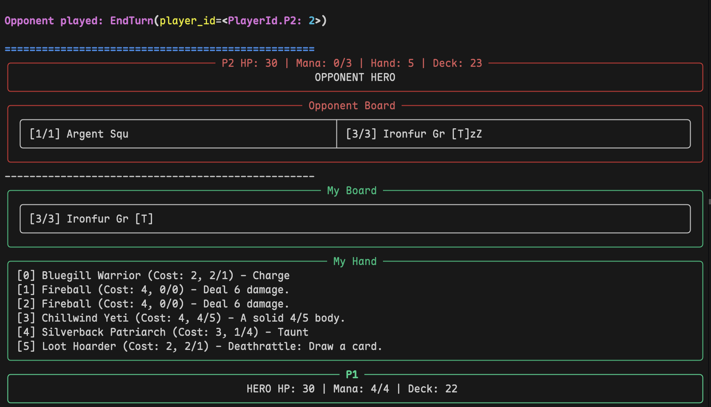

# CLI Hearthstone (RL Simulator) 🐉🗡️

A minimal, terminal-based Hearthstone engine built from the ground up to support Reinforcement Learning (RL) research. The engine provides clean hooks into environment states, observation bounds, and handles all classic combat processing, spell casting, event buses (secrets, deathrattles), and the mulligan phase.

## Current State

The game is currently fully playable through **Phase 8.1** of the implementation plan, bringing support for:
- 🦸 **11 Hero Classes**: Full support for all 11 Hearthstone classes and their respective Hero Powers, including Demon Hunter and Death Knight!
- 🏰 The **Mulligan phase** (pre-game redraws)
- 🪚 **Weapons** & Hero direct attacks
- ❓ **Secrets** mapped through an EventBus `PRE_RESOLUTION` phase
- 🃏 **Data Import Core**: Loads authentic Hearthstone cards from `cards.json`
- 🛠️ **CLI Utilities**: Dedicated terminal commands for examining cards, searching effects, and validating deck metadata.

---


## How to Play (Human Agent)

Ensure you configure your environment variables first so your Python instance points to the `src` directory containing the modules. 

```bash
export PYTHONPATH=src
python3 -m hsrl.cli.play --p1 human --p2 random --deck1 decks/mage_test.json
```
*Note: Depending on your python alias and dependencies, you must have `rich` installed via pip.*

### Match Start (Mulligan)

On Boot, the `MULLIGAN` phase is immediately triggered. The console will prompt you to toss away cards in your starting hand. 
* To throw away the first and second card: Type `mulligan 0 1`
* To keep all cards (no redraw): Type `mulligan`

### In-Game Commands

When your Main Phase starts, use these interactive shell commands to maneuver on the board:

| Command Structure | Description |
|---|---|
| `play <hand_index> <board_position> [target_p] [target_idx]` | Play a standard minion card from your hand into the board position of your choice. Positions are 0-indexed. Example: `play 2 0` |
| `play_spell <hand_index> [target_p] [target_idx]` | Play a spell to deal damage, heal, etc. |
| `play_weapon <hand_index>` | Equip a hero weapon. |
| `play_secret <hand_index>` | Set an active secret. |
| `hero_power [target_p] [target_idx]` | Spend 2 mana to use your Class Hero Power. |
| `attack <attacker_index> <target_index>` | Command a minion to attack. `attacker_index` aligns to your board array (0..N). `target_index` aligns to opponent's board (0..N). Target `-1` attacks the enemy **Hero!** |
| `attack -1 <target_index>` | Direct your **Hero** to attack based on equipped weapon statistics. |
| `end` | Conclude your current turn. |

> **Targeting:** For spells, battlecries, or hero powers that require a target, supply `[target_p]` (1 for P1, 2 for P2) and `[target_idx]` (0..N for board minions, -1 for the hero) at the end of the command. For example, `play_spell 1 2 0` targets P2's first minion.

**Example Turn:**
```text
play_weapon 1
attack -1 -1
play 0 0
end
```

## Cards & Decks CLI

To test or construct explicit datasets, deck configurations can be serialized as JSON configurations and validated/stored using the Deck Manager interface. Decks must follow a strict dictionary schema defining the `hero_class` to ensure classes constraints and auto-assign the hero power:
```json
{
  "hero_class": "MAGE",
  "cards": ["CS2_022", "CS2_022"]
}
``` 

### Managing Cards
Use the `hsrl.cli.cards` tool to explore imported sets:
```bash
PYTHONPATH=src python3 -m hsrl.cli.cards search fire
PYTHONPATH=src python3 -m hsrl.cli.cards show blizzard
PYTHONPATH=src python3 -m hsrl.cli.cards list --needs-effect
PYTHONPATH=src python3 -m hsrl.cli.cards list --implemented
```

### Managing Decks
Use the `hsrl.cli.deck_manager` tool to test rule compliance and view Mana Curves:
```bash
PYTHONPATH=src python3 -m hsrl.cli.deck_manager validate decks/test.json
PYTHONPATH=src python3 -m hsrl.cli.deck_manager stats decks/test.json
```

## AI & Agents

AI baselines operate via `hsrl.agents.*`, plugging interchangeably directly into `game.py`. Run `python3 -m hsrl.cli.play --p1 random --p2 random` to watch a sandbox instance play itself instantly.
